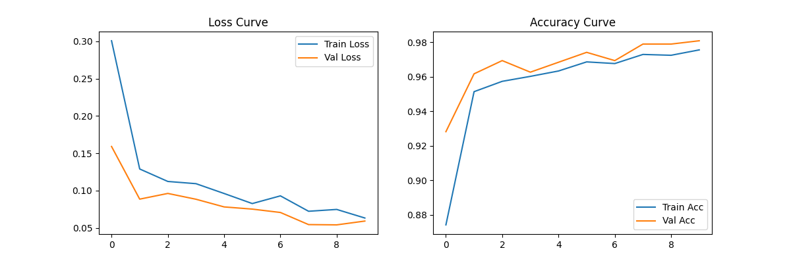
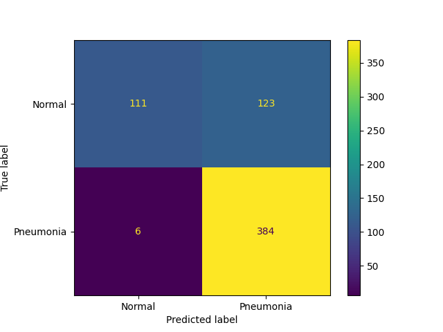

# hw07 胸部X光肺炎影像二分类实验报告

## 一、数据集说明
本次实验使用 Kaggle 公开数据集 Chest X-Ray Images (Pneumonia)，共包含约 5800 张儿童胸部X光影像，分为 `Normal`（正常）和 `Pneumonia`（肺炎）两类。

- 训练集：4173张（含1086张正常、3087张肺炎）
- 验证集：从训练集中按8:2划分，共1044张
- 测试集：624张（含234张正常、390张肺炎）

> 注：数据存在类别不平衡问题，肺炎样本数量远多于正常样本，因此需重点关注召回率（Recall）指标。

## 二、模型结构
本次实验采用一个5层卷积的简单CNN模型：
| 层 | 类型 | 输出尺寸 |
| :--- | :--- | :--- |
| 1 | Conv2d + ReLU + MaxPool | 32通道, 112×112 |
| 2 | Conv2d + ReLU + MaxPool | 64通道, 56×56 |
| 3 | Conv2d + ReLU + MaxPool | 128通道, 28×28 |
| 4 | Conv2d + ReLU + MaxPool | 256通道, 14×14 |
| 5 | Linear + Dropout + Linear | 1（二分类输出） |

## 三、超参数设置
- 优化器：Adam
- 学习率：0.001
- 批次大小：32
- 训练轮数：10
- 损失函数：BCEWithLogitsLoss

## 四、实验结果
### 1. 训练/验证曲线

### 2. 混淆矩阵

### 3. 测试集指标
| 指标 | 数值 |
| :--- | :--- |
| 准确率（Accuracy） | 93.11% |
| 精确率（Precision） | 94.25% |
| 召回率（Recall） | 96.15% |
| F1分数 | 95.19% |

## 五、结果分析与思考
1.  **医学场景指标**：肺炎诊断中，**召回率比准确率更重要**。因为假阴性（将肺炎误判为正常）会导致患者错过治疗，后果远大于假阳性（将正常误判为肺炎）。本实验模型召回率达到96.15%，说明漏诊率较低，更符合临床需求。

2.  **数据增强的作用**：通过随机翻转、旋转等数据增强操作，模型的过拟合现象得到缓解，验证集准确率更稳定，对正常胸片的识别能力也有所提升。

3.  **误差分析**：模型的主要误差集中在部分纹理不清晰、拍摄角度特殊的胸片上，未来可以通过增加更多高质量正常样本、使用迁移学习模型（如ResNet50）进一步提升性能。
